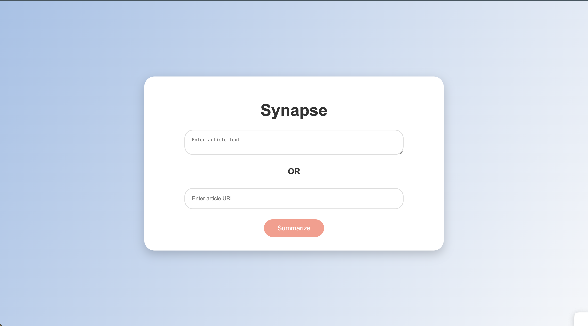

# Synapse: AI-Powered Article Summarizer


## Overview
Synapse is an AI-powered article summarizer that allows users to input text or URLs of articles to generate concise summaries. The project includes a machine learning model for summarization, a web interface for user interaction, and scripts for data fetching and preprocessing.


## Directory Structure
```
.
├── app
│   ├── __init__.py
│   ├── __pycache__
│   │   ├── __init__.cpython-312.pyc
│   │   └── summarizer.cpython-312.pyc
│   ├── main.py
│   ├── summarizer.py
│   └── templates
│       └── index.html
├── data
│   ├── articles.json
│   ├── model.pth
│   ├── preprocessed_data.txt
│   └── vocabulary.txt
├── model
│   ├── __init__.py
│   ├── load_data.py
│   ├── preprocess.py
│   ├── tokenizer.py
│   └── train_model.py
├── requirements.txt
├── scripts
│   └── data_fetcher.py
└── static
    ├── script.js
    └── styles.css
```
## Description Of Each File

### app/
#### __init__.py: 
Initializes the Flask application and sets up the necessary configurations. This file ensures that the app directory is treated as a module.
#### main.py: 
Contains the main routes for the Flask web application. It handles rendering the home page and processing user inputs for summarization.
#### summarizer.py: 
Includes the core functions for summarizing text. It interacts with the trained model to generate summaries.
#### templates/index.html: 
The HTML template for the web interface. It provides a user-friendly interface for inputting text or URLs and displaying the generated summaries.
### data/
#### articles.json: 
Stores fetched articles in JSON format. This file is used for training the summarization model.
#### model.pth: 
The trained model file. It contains the weights and parameters of the summarization model.
#### preprocessed_data.txt: 
Preprocessed text data used for training. This file includes cleaned and tokenized text.
#### vocabulary.txt: 
Vocabulary file containing the words used in the training data. It is essential for the tokenizer to convert text to numerical format.
### model/
#### __init__.py: 
Initializes the model directory as a module.
#### load_data.py: 
Contains functions for loading and processing data from files. It prepares the data for training and evaluation.
#### preprocess.py: 
Handles text preprocessing tasks such as cleaning, tokenizing, and normalizing text.
#### tokenizer.py: 
Includes functions for tokenizing text based on the vocabulary. It converts text to numerical format for model training.
#### train_model.py: 
The training script for the summarization model. It defines the training loop, loss function, and optimization process.
### requirements.txt
Lists all the Python dependencies required for the project. These packages can be installed using pip install -r requirements.txt.

### scripts/
#### data_fetcher.py: 
Script to fetch articles from various sources. It saves the fetched articles to articles.json for training purposes.
### static/
#### script.js: 
JavaScript file for handling client-side interactions. It manages the form submissions and displays the generated summaries.
#### styles.css: 
CSS file for styling the web interface. It ensures the web page is visually appealing and user-friendly.
## Installation and Running the Application

### Prerequisites
- Python 3.8+
- Flask
- PyTorch
- Other dependencies listed in requirements.txt
### Installation
1. Clone the repository:
    ```
    git clone https://github.com/IshaMadhukarShinde/Synapse.git
    cd synapse
    ```
2. Set Up Virtual Environment

    [Follow the instructions from the pyenv GitHub repository](https://github.com/pyenv/pyenv) to install `pyenv` on your system.

    ```
    pyenv install 3.10.8
    pyenv virtualenv 3.10.8 synapse-venv
    pyenv activate synapse-venv
    ```
    Once you are done with your env deactive it with:
    ```
    pyenv deactivate
    ```
3. Install Dependencies
    ```
    pip install -r requirements.txt
    ```
4. Fetch Data
    ``` 
    python scripts/data_fetcher.py
    ```
5. Preprocess Data
    ```
    python model/preprocess.py
    ```
6. Train the Model

    ```
    python model/train_model.py
    ```
7. Run the Application


    ```
    export FLASK_APP=app/main.py
    export FLASK_ENV=development
    flask run
    ```
8. Access the Application

    Open a web browser and go to http://127.0.0.1:5000

    Here is a screenshot of the user interface:

    
## Usage

- Input Article Text: Enter the text of the article you want to summarize in the text box.
- Input Article URL: Enter the URL of the article you want to summarize.
- Summarize: Click the "Summarize" button to get the summary.

## Logging

The application logs important events and errors to the console, providing useful information for debugging and monitoring.

## Contributing

Feel free to contribute to the project by submitting issues or pull requests. Make sure to follow the project's code of conduct.